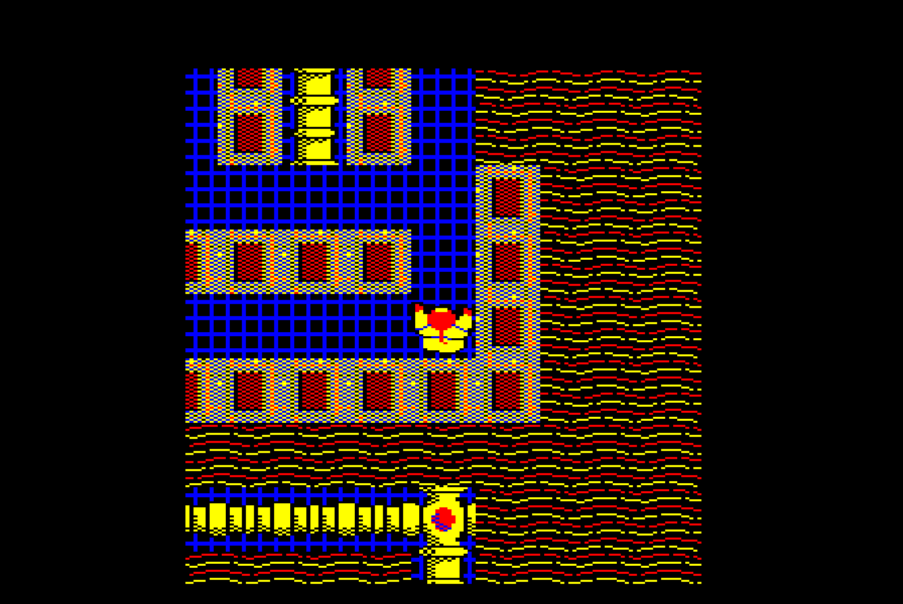
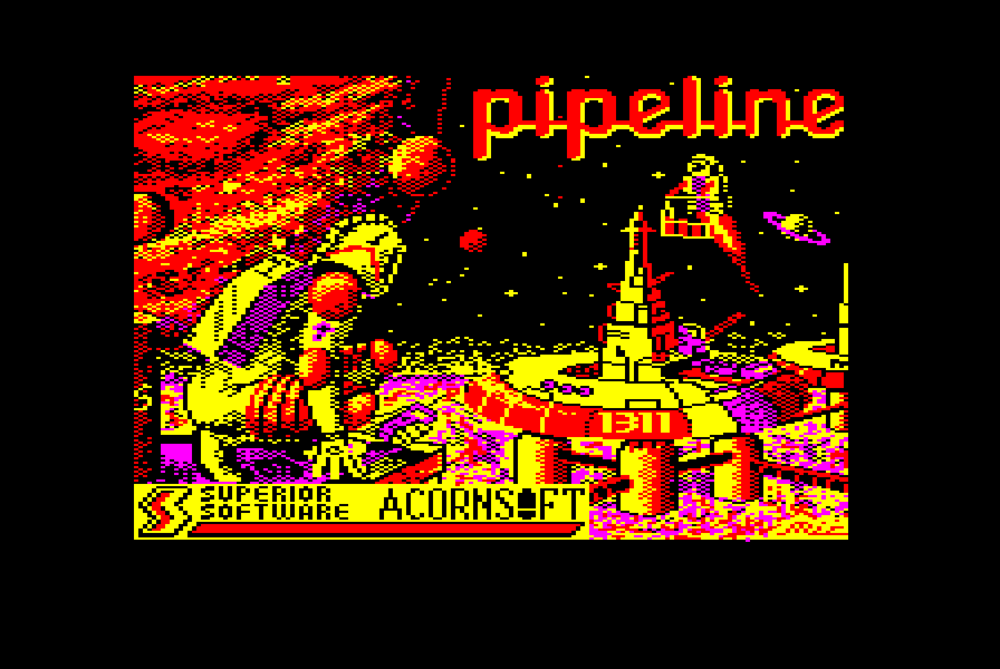
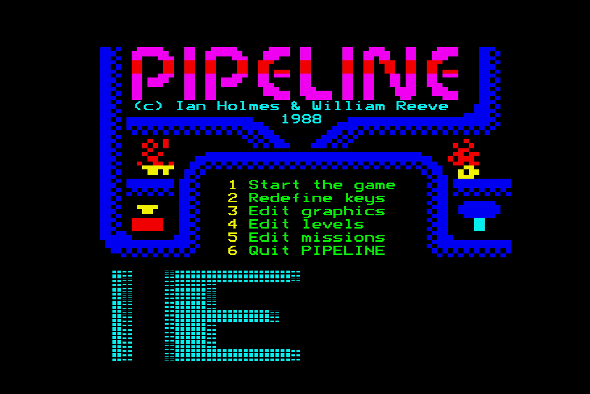
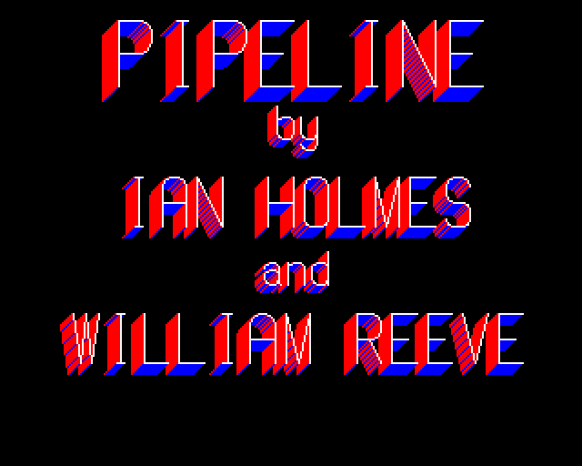
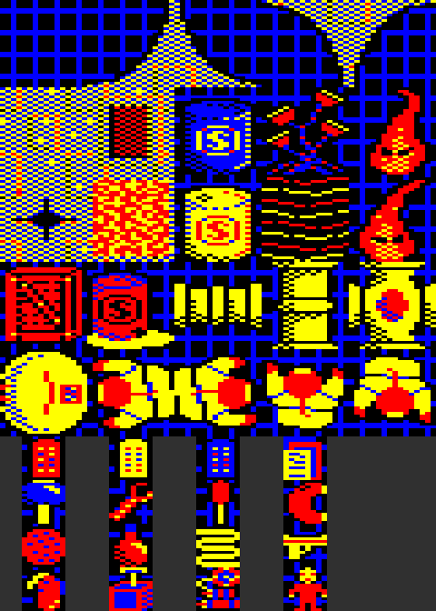

# PIPELINE disassembly

[](https://github.com/mattgodbolt/pipeline-disasm/actions/workflows/ci.yml)

A rebuild-from-source of **PIPELINE** for the BBC Micro, by Ian Holmes and
William Reeve, published by Superior Software in 1988. Commented
[baron](https://github.com/waitingforvsync/baron) assembly (and the BASIC
programs, as BASIC) assembles into a disc image byte-for-byte identical to
the original release, including the uncatalogued sectors the real programs
hide in, and a flux image that also carries the original's deleted data
marks.



## What's on the disc

| | |
|---|---|
|  |  |
|  |  |

- **!BOOT**, **MENU** (BASIC, "Originally: GUILDMASTER"), with a Mode 7
  scroller and the menu screen packed into its heap; **WARNING**, **SCREEN**.
- **The game** (`src/hidden_game.6502`): loaded from hidden sectors by a
  217-byte stub, it relocates itself into low memory and loads **IO**, the
  mission file: four levels, the graphics and the object names
  (`src/io.6502`, with the maps and pictures drawn in the source). **TITLE**
  unpacks the title picture first.
- **The Graphics Designer** and **the Level Designer**, also hidden, with
  their data: **DEFAULT** (the graphics set), **LEVEL1**, **WDATA**,
  **LDATA**. **MISSION** (BASIC) combines their files into an IO.
- **PL**, "Ian's cheat!", self-decrypting and hidden behind two keys held at
  boot. **MRUN** takes the editors back to the menu.

The copy protection is in two layers: the three programs live in sectors no
catalogue entry mentions, and every one of those sectors was written with a
deleted data address mark, which stops a DFS `*BACKUP`. See
[original/README.md](original/README.md) and `src/hidden_loader.6502inc`.

## How the code works

The game is an engine for missions. About 8K of 6502 draws an 8 x 8 cell
view of a 64 x 64 map, scrolled by the hardware a character at a time as
the player walks. It moves four flame monsters and a thrown object, and runs
each level's 32 triggers: rules that fire when the player steps on a place
or uses or throws an object there, and change the map, move a monster or
teleport the player. Everything that makes a level a puzzle is data in the
mission file, which the two designers and MISSION make.

In the source, each program reads from a header that says where it lives in
memory and how it's reached. The levels and graphics are written as maps and
pictures rather than as bytes. [docs/overview.md](docs/overview.md) is the
guide to the code. It covers how the programs hand over, what's where in
memory while each runs, and which routines to read first.

## Building

```
npm ci        # once: jsbeeb's disc code builds and checks the flux image
make verify
```

needs baron 0.5 or later (looked for at `../baron/build/src/baron`, else on
the `PATH`; override with `BARON=...`), Python 3.11 or later and node. It writes
`build/pipeline.ssd` and compares it with `original/pipeline.ssd` byte for
byte, and `build/pipeline.hfe`, which it compares sector by sector (IDs,
data and data marks) with the original flux capture. `make test` adds the
tools' own tests. Baron's symbol dump lands in `build/symbols.json`, and a
listing in `build/listing.txt`.

`node tools/beeb.mjs` and `node tools/play.mjs` run the disc headless in
jsbeeb, for screenshots, memory dumps and execution traces.

## Layout

```
original/      the original disc (.ssd and the flux capture), and where they came from
src/*.6502     baron source, one file per piece of the disc; *.6502inc shared definitions
src/disc.toml  where each piece goes on the disc
data/          the few binaries left: pictures, and PL's encrypted bytes
tools/         disc building and comparison, disassembly, emulator and rendering tools
tests/         tests of the tools and of derived data
hints/         how each first-draft disassembly was made
docs/          the guide to the code, the journal, notes per piece, images
```

[docs/journal.md](docs/journal.md) is the story so far; `docs/notes/` has the
detail for each piece.

## Credits

PIPELINE is by Ian Holmes and William Reeve, © 1988, published by Superior
Software. This disassembly is by Matt Godbolt and Claude.
